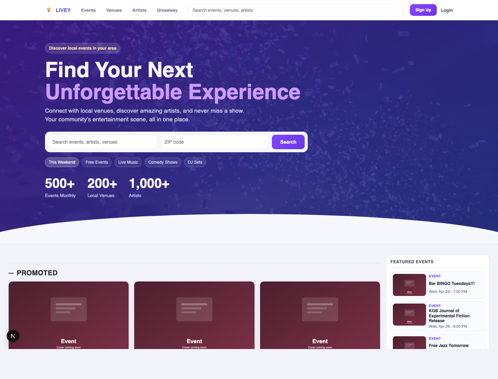
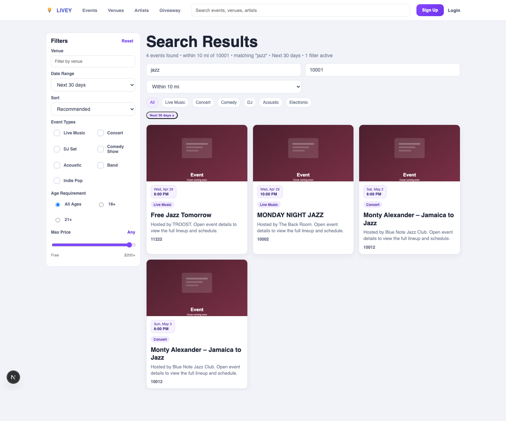
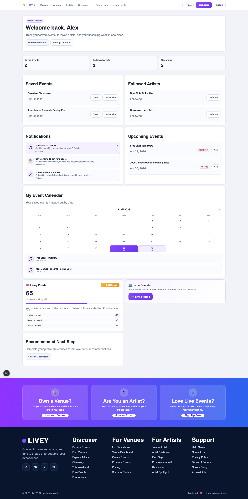

# LIVEY

<div align="center">
  <strong>Local event discovery for fans, venues, and artists.</strong>
  <br />
  <span>Search nearby shows, save plans, follow artists, track reminders, and grow engagement with points and invites.</span>
  <br />
  <br />
  
  
  
  
</div>

<br />



## Product Story

LIVEY is a full-stack entertainment platform built to make local nights out easier to discover, plan, and promote. Fans can search events by ZIP code, browse trending and promoted shows, save events, follow artists, and keep a personal dashboard of upcoming plans. Venues and artists get dedicated profile and dashboard flows for publishing, discovery, and audience growth.

The app is built as a monorepo with a Next.js App Router frontend, a FastAPI backend, and Supabase for Postgres, auth, storage, and row-level security.

## Highlights

| Fan Experience | Venue and Artist Tools | Engagement Layer |
| --- | --- | --- |
| ZIP-based event search with radius controls | Venue dashboards and event creation | LIVEY points for saves, shares, reviews, interest, and invites |
| Category, date, venue, age, event-type, and max-price filters | Artist dashboards and public artist profiles | VIP tier badge driven by point progress |
| Saved events, followed artists, notifications, and event calendar | Venue pages, follow buttons, and profile management | Invite-a-friend links with non-constant referral codes |
| Trending, promoted, and popular discovery shelves | Sponsored/promoted event badges | Reminder-oriented dashboard and calendar views |

## Screenshots

| Discovery Home | Search and Filters |
| --- | --- |
|  |  |

| User Dashboard |
| --- |
|  |

## What We Built Recently

- Points system with action-based rewards and a VIP progress badge.
- Invite friend card with unique referral codes and clipboard sharing.
- Saved event dashboard with upcoming reminders and calendar mapping.
- Search filters for age, event type, venue, date range, radius, and max price.
- Price-aware search summaries so cost filters can exclude over-budget or unknown-price events.
- Promoted and sponsored event presentation across discovery surfaces.
- Venue and artist follow flows with dashboard-friendly saved/followed lists.
- Scraper-backed event ingestion paths, cover-image fallbacks, and optional event metadata support.

## Architecture

```text
fidelis/
  apps/
    web/       Next.js App Router frontend
    api/       FastAPI service and route handlers
  packages/
    shared/    Shared TypeScript contracts
  supabase/
    migrations/ SQL schema, seed data, and RLS policy evolution
  docs/        Product, architecture, and screenshot assets
```

### Frontend

- Next.js 15 App Router with React 19 and TypeScript.
- Local-first UX helpers for recently viewed items, points, invite links, and dashboard state.
- Responsive discovery, search, dashboard, profile, venue, artist, and event detail screens.

### Backend

- FastAPI routes for events, venues, artists, profiles, favorites, follows, claims, auth, discovery, and scraper operations.
- Supabase-backed data access with compatibility fallbacks for evolving event columns.
- Event summary normalization for venue ZIP fallback, cover images, promoted status, and price values.

### Data and Auth

- Supabase Postgres schema migrations in `supabase/migrations`.
- Supabase Auth session handling in the web app.
- Role-aware user, venue, artist, and admin flows.

## Quick Start

### Prerequisites

- Node.js 20+ (tested with Node 24)
- npm 10+
- Python 3.9+
- Supabase project credentials for local API/auth flows

### Install

```bash
npm install
pip3 install -r apps/api/requirements.txt
```

### Configure

```bash
cp apps/web/.env.example apps/web/.env.local
cp apps/api/.env.example apps/api/.env
```

Set the following values:

- `apps/web/.env.local`: `NEXT_PUBLIC_API_URL`, `NEXT_PUBLIC_SUPABASE_URL`, `NEXT_PUBLIC_SUPABASE_ANON_KEY`
- `apps/api/.env`: Supabase URL, service credentials, and scraper/provider keys as needed

### Run Locally

Terminal 1:

```bash
npm run dev:web
```

Terminal 2:

```bash
npm run dev:api
```

Open:

- Web app: `http://localhost:3000`
- Local API docs: `http://localhost:8000/docs`
- Production API docs: `https://fidelisappsapi-production.up.railway.app/docs`

## Validation

Useful checks before shipping:

```bash
npm run lint:web
npm run build:web
cd apps/api && .venv/bin/python -m pytest
```

Targeted checks used while refreshing this README:

```bash
npm run dev:web
npm run dev:api
cd apps/api && .venv/bin/python -m pytest tests/test_events_search.py
```

## Docs

- [Architecture](docs/architecture.md)
- [Feature Matrix](docs/feature-matrix.md)
- [Auth Notes](docs/auth.md)
- [Source Intake](docs/source-intake.md)
